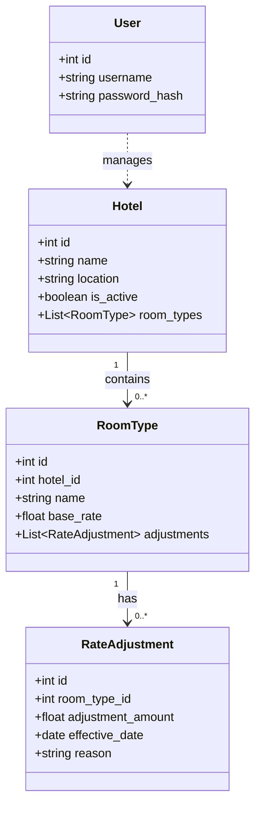
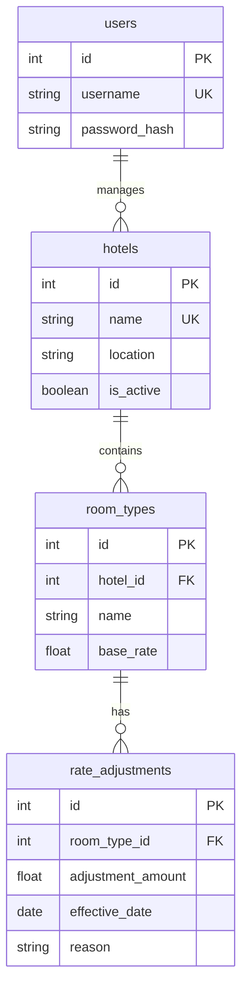
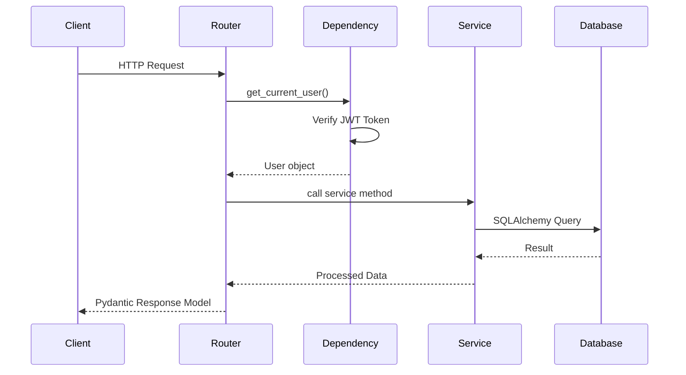
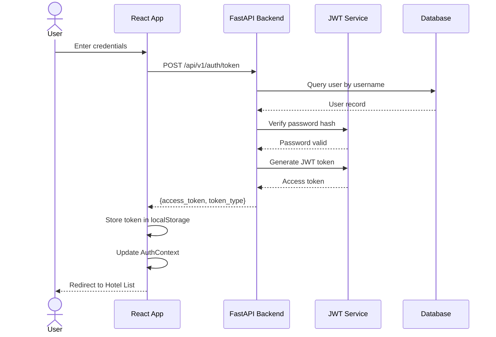
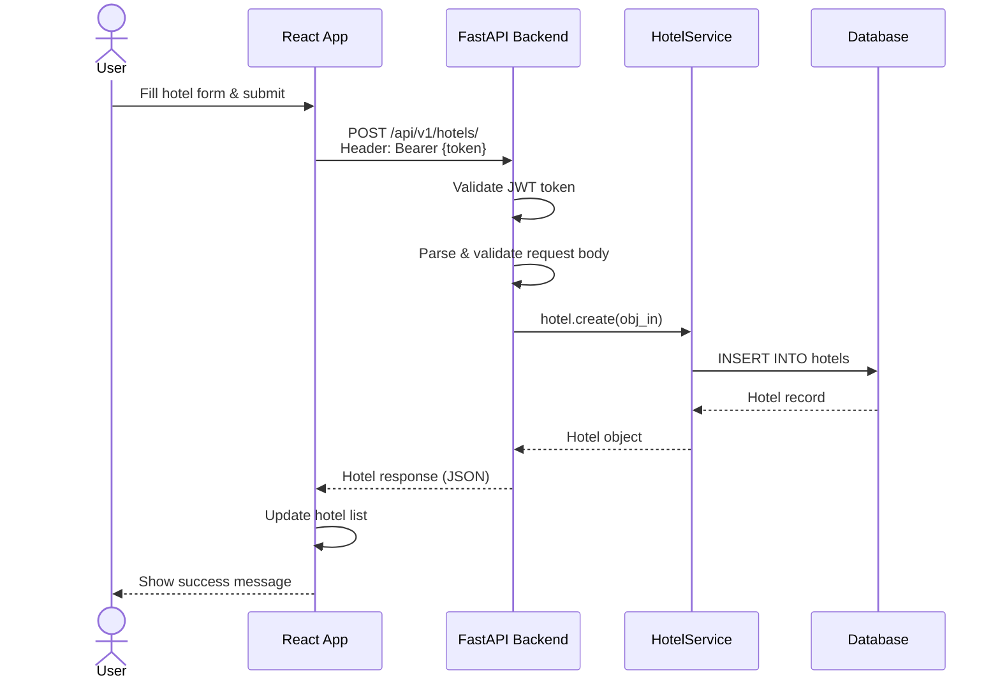
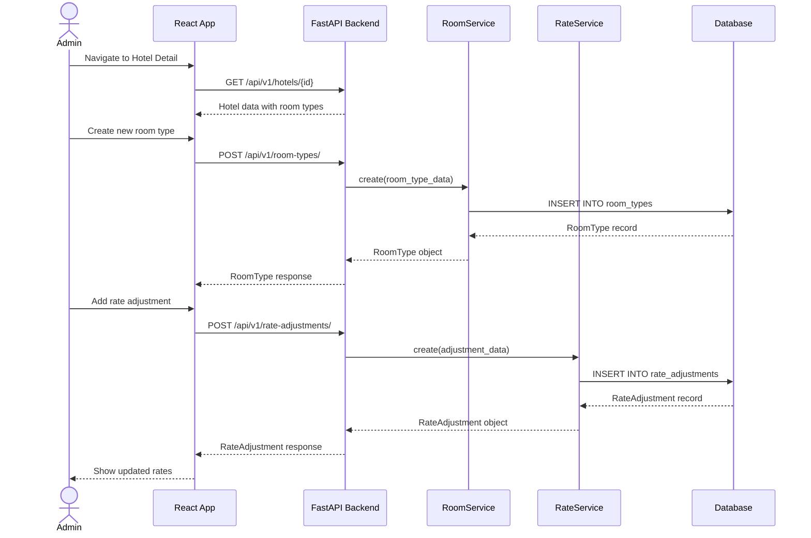
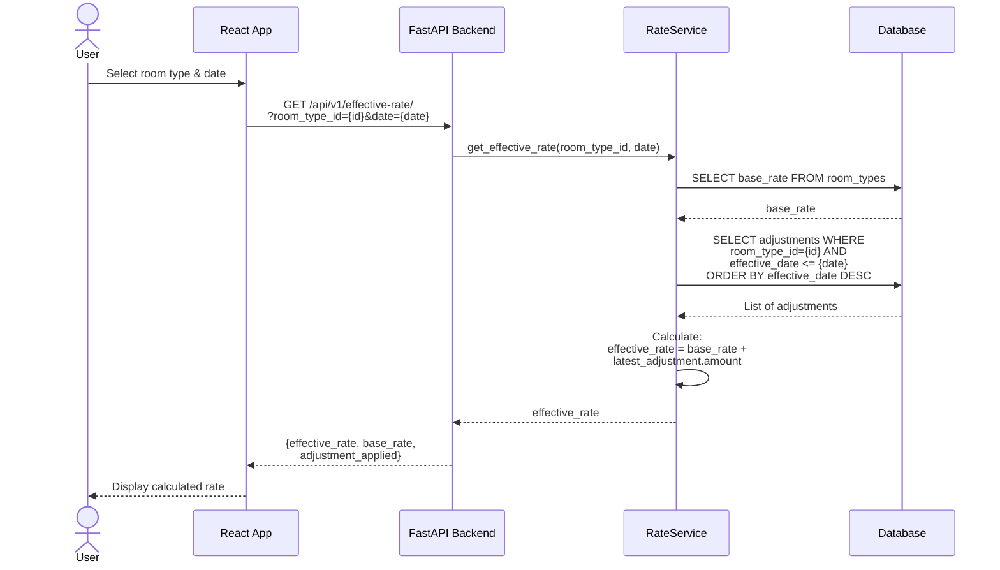
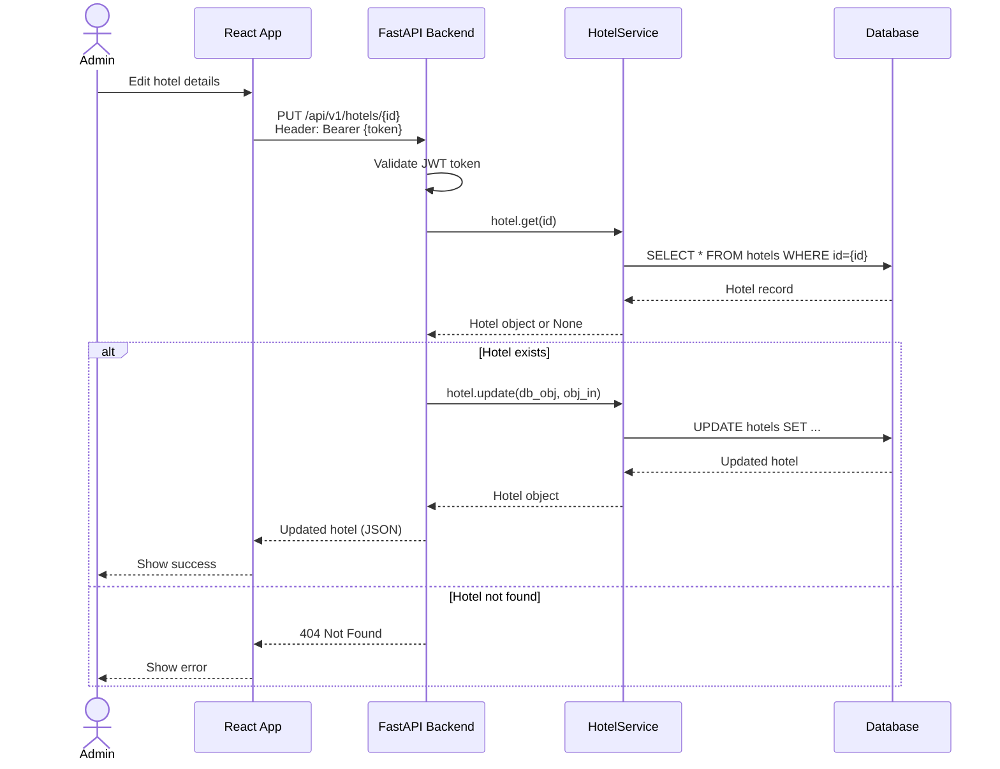
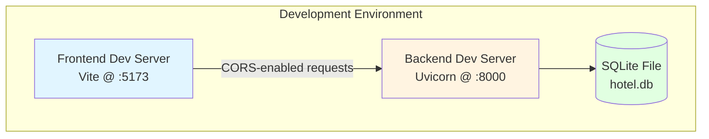
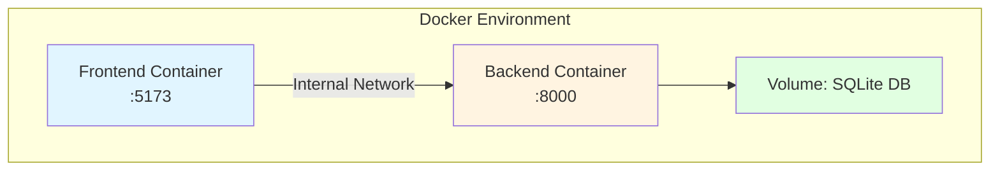

# Basic Hotel Platform - Architecture Documentation


## Overview

The Basic Hotel Platform is a full-stack hotel administration application designed to manage hotels, room types, and dynamic rate adjustments. The system follows a clean, layered architecture with clear separation between frontend, backend API, and data persistence layers.

### Key Features
- **JWT-based Authentication**: Secure login with token-based authentication
- **Hotel Management**: CRUD operations for hotels
- **Room Type Management**: Define and manage different room types per hotel
- **Dynamic Rate Adjustments**: Apply date-specific rate modifications
- **Effective Rate Calculation**: Automatic calculation of final rates based on base rates and adjustments

---

## Domain Model

The system is built around four core domain entities:



### Entity Descriptions

- **User**: Admin users who can authenticate and manage the system
- **Hotel**: Physical hotel properties with name, location, and active status
- **RoomType**: Categories of rooms within a hotel (e.g., Deluxe, Suite) with base pricing
- **RateAdjustment**: Date-specific rate modifications applied to room types

---

## Database Schema (ER Diagram)



### Relationships

- **users ↔ hotels**: Implicit relationship through authentication (all operations require authenticated user)
- **hotels ↔ room_types**: One-to-Many (A hotel can have multiple room types)
- **room_types ↔ rate_adjustments**: One-to-Many (A room type can have multiple rate adjustments over time)

### Indexes
- `users.username`: Unique index for fast user lookup
- `hotels.name`: Unique index for hotel identification
- Primary keys on all tables

---

## API Architecture

### API Structure

```
/api/v1/
├── /auth
│   └── POST /token              # Login & get JWT token
├── /hotels
│   ├── POST /hotels/            # Create hotel
│   ├── GET /hotels/             # List hotels
│   ├── GET /hotels/{id}         # Get hotel details
│   ├── PUT /hotels/{id}         # Update hotel
│   └── DELETE /hotels/{id}      # Delete hotel
├── /rooms
│   ├── POST /room-types/        # Create room type
│   ├── GET /room-types/         # List room types
│   ├── GET /room-types/{id}     # Get room type details
│   ├── PUT /room-types/{id}     # Update room type
│   └── DELETE /room-types/{id}  # Delete room type
└── /rates
    ├── POST /rate-adjustments/  # Create rate adjustment
    ├── GET /rate-adjustments/   # List rate adjustments
    └── GET /effective-rate/     # Calculate effective rate for date
```

### Request/Response Flow



---

## Frontend Architecture

### Component Structure

```
src/
├── api/                    # API client layer
│   ├── auth.ts            # Authentication API calls
│   ├── hotels.ts          # Hotel API calls
│   ├── rooms.ts           # Room type API calls
│   └── rates.ts           # Rate adjustment API calls
├── components/            # Reusable UI components
│   ├── Header.tsx
│   ├── HotelCard.tsx
│   ├── RoomTypeCard.tsx
│   └── RateAdjustmentForm.tsx
├── context/              # React Context
│   └── AuthContext.tsx   # Authentication state
├── pages/                # Page components
│   ├── LoginPage.tsx
│   ├── HotelListPage.tsx
│   └── HotelDetailPage.tsx
├── styles/               # CSS modules
└── App.tsx              # Main app component
```

### State Management

- **Authentication State**: Managed via React Context (`AuthContext`)
- **Local State**: Component-level state with `useState` hooks
- **API State**: Handled through async/await with axios

---

## Sequence Diagrams

### 1. User Authentication Flow



### 2. Create Hotel Flow



### 3. Create Room Type with Rate Adjustment Flow



### 4. Calculate Effective Rate Flow



### 5. Update Hotel Flow



## Configuration & Environment

### Backend Configuration

Configuration loaded from environment variables:

```env
# CORS Settings
BACKEND_CORS_ORIGINS=["http://localhost:5173"]

# JWT Settings
SECRET_KEY=<secret-key>
ALGORITHM=HS256
ACCESS_TOKEN_EXPIRE_MINUTES=30

# Database
DATABASE_URL=sqlite:///./hotel.db
```

### Frontend Configuration

```env
# API Base URL
VITE_API_URL=http://localhost:8000
```

---

## Deployment Architecture

### Development Setup



### Docker Compose Setup



